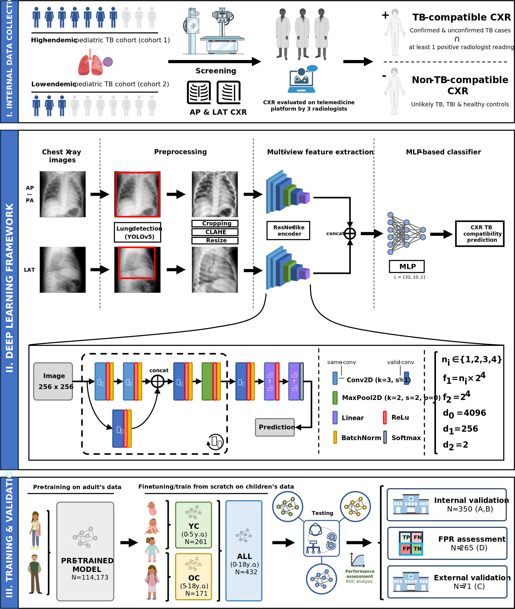

# pTBLightNet
Official repository for pTBLightNet: Multi-View Deep Learning Framework for the Detection of Chest X-Rays Compatible with Pediatric Pulmonary Tuberculosis

## Table of Contents

- [Introduction](#introduction)
- [Installation](#installation)
- [Usage](#usage)
    - [Inference (MWE)](#inference-mwe)
    - [Use Custom Dataset](#use-custom-dataset)
    - [Inference on Custom Data](#inference-on-custom-data)
    - [Useful Tips and Considerations](#useful-tips-and-considerations)
- [How to cite](#how-to-cite)
- [How to contribute](#how-to-contribute)
- [License](#license)

## Introduction
Tuberculosis (TB) remains a major global health burden, particularly in low-resource, high-prevalence regions. Pediatric TB presents unique challenges due to its non-specific symptoms and less distinct radiological manifestations compared to adult TB. Many children who die from TB are never diagnosed or treated, highlighting the need for early detection and treatment. The World Health Organization recommends chest X-ray (CXR) for TB screening and triage as part of diagnostic protocols due to its ability to rapidly assess pulmonary TB-related abnormalities and its widespread availability. In this study, we present pTBLightNet, a novel multi-view deep learning framework designed to detect pediatric pulmonary TB by identifying TB-compatible CXRs with consistent radiological findings. Our approach leverages both frontal and lateral CXR views to enhance prediction accuracy. We used diverse adult CXR datasets (N = 114,173) to pre-train our framework and CXR datasets (N = 918) from three pediatric TB cohorts for fine-tuning or training from scratch, and for evaluation. Our approach achieved an area under the curve of 0.903 on internal testing. External evaluation confirmed its effectiveness and generalizability using as CXR TB compatibility, expert reading, microbiological confirmation and case definition as reference standards. Age-specific models (<5 and 5-18 years old) performed competitively to those trained in larger undifferentiated populations, and incorporating lateral CXRs improved diagnosis in younger children compared to using only frontal CXR. Comparisons across different age groups demonstrated the robustness of the model, indicating its promise for improving TB diagnosis across ages, particularly in resource-limited settings.

<p align="center">

</p>


## Installation

We highly recommend first creating a virtual environment using Miniconda/Anaconda. This code was developed using CUDA 11.8 and Python 3.9, although higher versions may also be compatible with minimal modifications. Once this is done, please install the required libraries with pip:

```bash
pip install -r requirements.txt
```

## Usage

In this code, we provide a Minimal Working Example (MWE). The example data provided (3 internal and 1 external independent testing cases) is located in `data/`. There, you will find a `CSV` file with the dataset metadata and a `PKL` file with the images. 

The images are first converted into a `.pkl` file, then the code reads this file and processes the images. Although some example images are already converted in to a `.pkl` file in `data/mwe_data.pkl`, we also provide a script to convert custom data into this file. The command to run this process is as follows:

```bash
python ./data/img_to_pkl.py
```

### Inference (MWE)

In order to continue with the MWE, you can run inference on the example data provided by running the following command:

```bash
bash run_test_mwe.sh
```

This script will do the following:

1. Run inference on the example cases with the AP model. Results will be stored in `results_test_mwe/AP`. In this step, Grad-CAMs will be generated automatically.

2. Run inference on the example cases with the LAT model. Results will be stored in `results_test_mwe/LAT`. In this step, Grad-CAMs will be generated automatically.

3. Run inference on the example cases ensembling features from both the AP and LAT models. Results will be stored in `results_test_mwe/AP-LAT_ensemble`. Steps 1 and 2 are not required to run this third step. However, in order to generate Grad-CAMs, steps 1 and 2 have to be conducted separately.

### Use Custom Dataset

You can use your own dataset by following the next steps:

1. Create a CSV with your custom dataset (see `data/dataset_mwe.csv` and follow the same format). The split of the data should be already done at this point (column `split` and `fold_cv`(if cross-validation) contain this information).

2. Create a pickle file (`.pkl`) with a Python dict containing the images in numpy arrays the following way:

    ```
    dict: {
        <filename1>: {"AP": <Numpy Array1, 256x256>, "LAT": <Numpy  Array1, 256x256>}
        <filename2>: {"AP": <Numpy Array2, 256x256>, "LAT": <Numpy Array2, 256x256>},
        <filename3>: {"AP": <Numpy Array3, 256x256>, "LAT": <Numpy Array3, 256x256>},
        ...
        <filenameN>: {"AP": <Numpy ArrayN, 256x256>, "LAT": <Numpy ArrayN, 256x256>},
    }
    ```
    Where `<filename>` corresponds to the value of the filename field that appears in the corresponding row of the dataset (CSV). This is done this way to facilitate data access and to allow faster training than accessing and preprocessing the images at each step. If LAT view is not available, that field can be kept empty.

3. Once you have a `CSV`file and a `PKL` file for your custom dataset, you can generate a custom `config.yaml` configuration file. Please refer to `config/` directory to follow the same structure.

### Inference on Custom Data

In order to test one or more trained models on our data, we will need to:

1. Once you have a `CSV`file and a `PKL` file for your custom dataset, you must generate a custom `config.yaml` configuration file. This file contains all the configurations regarding the inference process. A default and functional version is already provided to you in `config` directory. We encourage users to experiment with different configurations.

2. Use the following command if wanting to infer with the single AP/LAT model:

    ```bash
    python test.py -cfg <path_to_config_file>
    ```

3. Use the following command if wanting to infer with the AP & LAT model ensemble:

    ```bash
    python test_ensemble.py -cfg <path_to_config_file>
    ```

3. You can check the output results in `out_dir` directory defined in the configuration file.

### Useful Tips and Considerations

- By default, preprocessing with CLAHE is applied to the input images. If CLAHE is not desired in the preprocessing step, change the `clahe -> enabled` parameter in the corresponding config file.

- To select a specific GPU in which to carry out the training or testing process, use `CUDA_VISIBLE_DEVICES=0,1,...` at the beginning of the command. Example:

   ```bash
    CUDA_VISIBLE_DEVICES=0 python test.py
    ```

- The program won't take into account the columns `patient_id`, `age_yo` and `sex` columns from the input CSV file that describes our dataset. You can omit that data or put them to 0. Moreover, if cross validation (CV) is enabled, please make sure that `fold_cv` column is properly included in the CSV.

- Suggested file naming for custom datasets: `<COHORT IDENTIFIER>_<CASE_IDENTIFIER>.<FORMAT>`. Example: `COH_001.jpg`

## How to cite

Please cite us if you are using this code!

- Capellán-Martín, D., Gómez-Valverde, J.J., Bermejo-Peláez, D. et al. 
  "A lightweight, rapid and efficient deep convolutional network for chest X-ray tuberculosis detection" 
  2023 IEEE 20th International Symposium on Biomedical Imaging (ISBI 2023). https://doi.org/10.1109/ISBI53787.2023.10230500

- Capellán-Martín, D., Gómez-Valverde, J. J., Sánchez-Jacob, R., et al. (2025). 
  "Multi-View Deep Learning Framework for the Detection of Chest X-Rays Compatible with Pediatric Pulmonary Tuberculosis." Under Review.

## How to contribute

If you have questions or suggestions, feel free to open an issue or PR at https://github.com/dani-capellan/pTBLightNet.

## License

This project is licensed under the Creative Commons Attribution-NonCommercial-NoDerivatives 4.0 International (CC BY-NC-ND 4.0) License. See the [LICENSE](LICENSE) file for details.